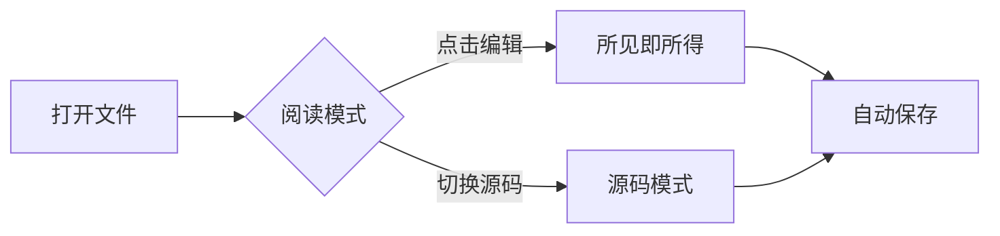

# Markly 演示文档

欢迎使用 **Markly** —— 一款追求苹果级审美的 Markdown 阅读器与编辑器。

## 基础排版

这是一段普通文本。支持 *斜体*、**粗体**、***粗斜体***、~~删除线~~ 以及 `行内代码`。链接渲染为 [Typora 风格](https://example.com) 的下划线悬停效果。

> 引用块带有主题色左边线与柔和底色，营造纸面批注感。
> 第二行引用文本。

## 列表

- 无序列表项一
- 无序列表项二
  - 嵌套列表项
    - 更深层级
- 无序列表项三

1. 有序列表第一项
2. 有序列表第二项
3. 有序列表第三项

### 任务列表

- [x] 完成渲染管线
- [x] 完成主题系统
- [ ] 完成导出功能
- [ ] 发布 1.0 版本

## 表格

| 功能 | 状态 | 备注 |
|:-----|:----:|-----:|
| 阅读模式 | ✅ | 默认模式 |
| 所见即所得 | 🔨 | P4 |
| 源码模式 | 🔨 | P3 |
| 导出 PDF | ⏳ | P7 |

## 代码高亮

```typescript
interface Document {
  title: string;
  content: string;
}

export function parseMarkdown(doc: Document): AST {
  const tokens = lexer.scan(doc.content);
  return parser.transform(tokens);
}
```

```python
def fibonacci(n: int) -> list[int]:
    seq = [0, 1]
    while len(seq) < n:
        seq.append(seq[-1] + seq[-2])
    return seq[:n]
```

## 数学公式

质能方程 $E = mc^2$ 是行内公式。

欧拉恒等式展示公式：

$$e^{i\pi} + 1 = 0$$

高斯积分：

$$\int_{-\infty}^{\infty} e^{-x^2} \, dx = \sqrt{\pi}$$

## Mermaid 图表



## 分隔线与脚注

---

这是一个脚注引用[^1]，还有另一个[^note]。

[^1]: 脚注会渲染在文档底部的「参考」区域。
[^note]: 支持任意标签的脚注。

---

*文档结束。*
